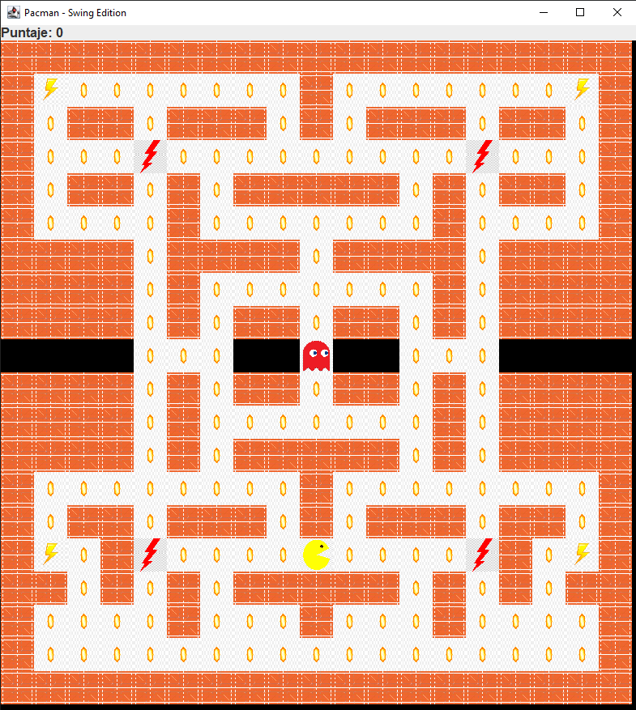
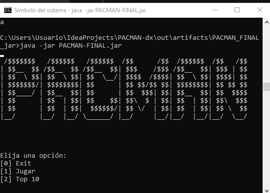

# 🟡 PACMAN-FINAL 🎮

Welcome to the **PACMAN-FINAL** repository!  
This project is a modern Java implementation of the classic **Pac-Man** game, built with Java 24 and managed using Maven.

## PACMAN - SWING


## PACMAN - CONSOLE

---

## 🚀 Features

- Classic *Pac-Man* game implemented in Java.
- Two game modes available:
  - **Console mode** (`ViewConsole`)
  - **Graphical mode** using Swing (`MenuSwing`)
- Scores are saved persistently in `puntajes.txt`.
- Maven-based project for easy compilation and execution.
- Uses **Lombok** to simplify code.

---

## 🛠 Requirements

- Java **17** or higher (Java **24** recommended)
- Maven
- A compatible IDE (IntelliJ IDEA, Eclipse, NetBeans, VS Code) or command-line terminal (cmd, bash, PowerShell)

---

## ⚙️ Installation and Execution

1. Clone the repository:
   ```bash
   git clone https://github.com/your-username/PACMAN-FINAL.git
   cd PACMAN-FINAL
